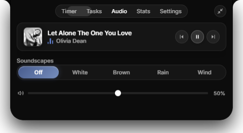

<div align="center">

# Pomodoro Island

### The tactile, notch-anchored focus companion for Windows.

Inspired by Apple's Dynamic Island. Designed for uninterrupted flow.

<br />

[](https://github.com/butterkookies/pomodoro-island/releases/latest)
[](https://github.com/butterkookies/pomodoro-island/releases/latest)
[](LICENSE)
[](https://github.com/butterkookies/pomodoro-island)

<br />


<br />

### [Download Latest Release (v1.0.0)](https://github.com/butterkookies/pomodoro-island/releases/latest)

<table>
  <tr>
    <td align="center" width="50%">
      <b>Windows Installer</b><br />
      <sub>1-click setup with desktop shortcut</sub><br /><br />
      <a href="https://github.com/butterkookies/pomodoro-island/releases/download/v1.0.0/pomodoro-island-1.0.0.Setup.exe"><b>Download Setup.exe</b></a>
    </td>
    <td align="center" width="50%">
      <b>Portable Edition</b><br />
      <sub>No installation required — extract and run</sub><br /><br />
      <a href="https://github.com/butterkookies/pomodoro-island/releases/download/v1.0.0/pomodoro-island-win32-x64-1.0.0.zip"><b>Download Portable .zip</b></a>
    </td>
  </tr>
</table>

</div>

---

## Why Pomodoro Island?

Traditional timer apps clutter your screen with floating windows, annoying popups, and disruptive chimes that break your flow.

Pomodoro Island transforms time management into a seamless physical extension of your display:

- **Hardware-Anchored**: Rests flush against the top monitor bezel with organic concave notch curves.
- **Click-Through in Idle**: Completely inert when you're working—never blocks tabs, address bars, or window headers.
- **Tactile 3D Controls**: Multi-layered ceramic controls, frosted glass progress gauge, and fluid spring physics.
- **Spotify & Media Aware**: Live track title, retina album artwork, and real-time equalizer for Spotify and web media.
- **Flow-State Overtime**: Continues counting past 00:00 in amber overtime mode so you never lose momentum mid-thought.
- **100% Private & Offline**: Zero analytics, zero accounts, and zero cloud tracking. Everything stays on your PC.

---

## Interface

<div align="center">

| Timer Hub | Spotify & Media Audio |
| :---: | :---: |
|  |  |
| *Tabular countdown, ceramic controls, presets, and focus goals* | *Retina album artwork, equalizer, media controls, and soundscapes* |

</div>

### Three Adaptive States

1. **Idle Capsule**: A hairline pill flush with your top bezel displaying remaining time, frosted progress, and mini music indicators. Transparent to mouse clicks.
2. **Compact Glance**: Glides into view on hover, revealing ceramic transport controls, current phase, and active track status.
3. **Expanded Command Hub**: Click to unveil the full productivity suite: timer presets, soundscapes, scratchpad notes, local focus stats, and display calibration.

---

## Global Keyboard Shortcuts

Control your timer from any app without interrupting your workflow:

| Shortcut | Action |
| :--- | :--- |
| <kbd>Ctrl</kbd> + <kbd>Alt</kbd> + <kbd>P</kbd> | Play / Pause Timer |
| <kbd>Ctrl</kbd> + <kbd>Alt</kbd> + <kbd>S</kbd> | Skip Phase (Focus ↔ Break) |
| <kbd>Ctrl</kbd> + <kbd>Alt</kbd> + <kbd>I</kbd> | Expand / Collapse Island |
| <kbd>Ctrl</kbd> + <kbd>Alt</kbd> + <kbd>M</kbd> | Toggle Ambient Sound |
| <kbd>1</kbd> – <kbd>5</kbd> *(expanded)* | Switch Tabs (Timer, Tasks, Audio, Stats, Settings) |

*Hotkeys use conflict-free `Ctrl+Alt` combinations to prevent collisions with code editor and browser shortcuts.*

---

## Getting Started

### 1. Download & Launch
1. Download [**`pomodoro-island-1.0.0 Setup.exe`**](https://github.com/butterkookies/pomodoro-island/releases/download/v1.0.0/pomodoro-island-1.0.0.Setup.exe) (or the [Portable Edition](https://github.com/butterkookies/pomodoro-island/releases/download/v1.0.0/pomodoro-island-win32-x64-1.0.0.zip)).
2. Run the installer. The island automatically anchors to the top notch of your primary monitor.
3. Hover over the notch to glance at your timer, or click to expand.

### 2. Build from Source

```bash
# Clone the repository
git clone https://github.com/butterkookies/pomodoro-island.git
cd pomodoro-island

# Install dependencies
npm install

# Run in development mode
npm run dev

# Build Windows installer and portable archive
npm run make
```

Packaged installers are generated in `out/make/`.

---

## License

Built with React, Electron, Framer Motion, and Vite. Distributed under the [MIT License](LICENSE).
