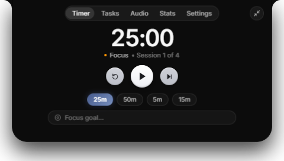
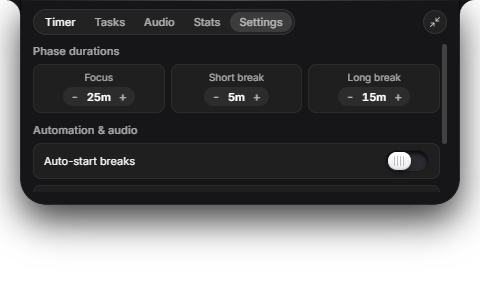

<div align="center">

# 🏝️ Pomodoro Island

### **The tactile, notch-anchored focus companion inspired by Apple's Dynamic Island.**

Pure Obsidian Glass • Fluid Spring Physics • Spotify & Media Aware • 100% Offline & Private

<br />

[](https://github.com/butterkookies/pomodoro-island/releases/latest)
[](https://github.com/butterkookies/pomodoro-island/releases/latest)
[](LICENSE)
[](https://github.com/butterkookies/pomodoro-island)

<br />


<br />

### ⚡ **[Download Latest Release (v1.0.0)](https://github.com/butterkookies/pomodoro-island/releases/latest)**

<table>
  <tr>
    <td align="center" width="50%">
      <h3>📦 1-Click Windows Setup</h3>
      <p>Seamless installer with automatic desktop shortcut & start menu launcher.</p>
      <a href="https://github.com/butterkookies/pomodoro-island/releases/latest"><b>👉 Download Setup.exe</b></a>
    </td>
    <td align="center" width="50%">
      <h3>💼 Portable Edition (No Install)</h3>
      <p>Zero installation required. Extract anywhere and launch directly.</p>
      <a href="https://github.com/butterkookies/pomodoro-island/releases/latest"><b>👉 Download Portable .zip</b></a>
    </td>
  </tr>
</table>

</div>

---

## ✨ Why Pomodoro Island?

Traditional timer apps clutter your workspace with loud floating windows, intrusive popups, and aggressive alerts that break your flow. 

**Pomodoro Island re-imagines time management as an organic extension of your physical hardware:**

- 🪟 **Anchored to Your Bezel**: Rests naturally at the top of your monitor with symmetrical concave notch flares matching modern hardware curves.
- 🍃 **Click-Through in Idle**: Completely inert when idle—never interferes with your browser tabs, editor title bars, or window management.
- ⚡ **Physical 3D Sensation**: Crafted with multi-layer ceramic tactile buttons, specular rim highlights, and physical actuation travel.
- 🌊 **Liquid Spring Dynamics**: Morphing animations tuned to Apple's critically damped spring physics (stiffness: 420, damping: 41) for seamless transitions without blank-frame flickers.
- 🔒 **Zero Telemetry, 100% Private**: Runs entirely offline on your device. No user tracking, no accounts, and zero cloud lock-in.

---

## 🎭 Three Fluid Morphing States

Pomodoro Island seamlessly adapts its presence depending on what you are doing:

<table width="100%">
<tr>
<td width="33%" align="center">
<h4>1. Idle Capsule</h4>
<p><i>Zero-distraction hairline companion</i></p>
<hr />
A minimal pill resting flush at the top bezel. Displays tabular countdown digits, frosted glass progress bar, and active mini music indicators. Completely click-through.
</td>
<td width="33%" align="center">
<h4>2. Compact Glance HUD</h4>
<p><i>Expands smoothly on cursor hover</i></p>
<hr />
Hero tactile play/pause ceramic disc, hold-to-reset skip trigger, active focus goal pill, and live Now Playing track glance with acoustic equalizer.
</td>
<td width="33%" align="center">
<h4>3. Expanded Command Hub</h4>
<p><i>One click to full productivity hub</i></p>
<hr />
Full pomodoro dashboard: custom timer presets, flow-state overtime mode, unified scratchpad, ambient soundscapes, focus analytics, and notch calibration.
</td>
</tr>
</table>

---

## 📸 Crafted Details & Design System

<div align="center">

| Expanded Timer Hub | Skeuomorphic Settings & Calibration |
| :---: | :---: |
|  |  |
| *Ceramic transport controls, presets & focus goals* | *Recessed skeuomorphic switches & display selection* |

</div>

### 🎨 Obsidian Glass Design System
- **Pure Pitch-Black Surface**: `#000000` glassmorphism canvas with hairline dividers (`rgba(255, 255, 255, 0.07)`).
- **Tabular Inter Typography**: High-legibility Inter font with fixed-width numerals (`tnum: 1`) preventing jitter during rapid countdowns.
- **Frosted Satin Progress Track**: Deep charcoal recessed track with frosted steel-blue progress fill and specular bulb endcap draining continuously in real-time.

---

## 🚀 Key Features

### 🎵 Live Spotify & System Media Awareness
- Automatically detects active audio playing on **Spotify Web**, **Spotify Desktop**, **YouTube**, **Apple Music**, or any browser/system media.
- Fetches crisp **300×300 retina album artwork** in milliseconds with zero login or API tokens needed.
- Displays an **animated 3-bar acoustic equalizer** (`ılı.`) showing active music playback across idle, compact, and expanded views.
- Full playback controls (Previous, Pause/Resume, Next) integrated directly into the Audio tab.

### 🌊 Flow-State Overtime Tracker
- Never get jarred out of your focus zone. When your sprint reaches `00:00`, Pomodoro Island automatically enters a sleek **amber overtime mode** with continuous counting, letting you finish your thought naturally.

### 🎯 Focus Goals & Unified Scratchpad
- Set your active focus objective right inside the timer bar.
- Compact glance pill renders your active goal with full support for international characters, spaces, and emojis (`🎯`, `🚀`).
- Unified session notes scratchpad allows quick thought-dumping without switching context.

### 🌧️ Ambient Soundscapes
- Built-in soothing background audio to drown out office noise and distractions:
  - 🌧️ *Gentle Rain*
  - 🪵 *Campfire*
  - ☕ *Cozy Cafe*
  - 🌊 *Ocean Waves*
  - 📻 *White Noise*

### 📊 Local Productivity Telemetry
- Comprehensive 7-day focus analytics: daily hours, focus streak, completion rate, and hourly activity heatmaps.
- All telemetry is stored locally on your machine (`electron-store`).

---

## ⌨️ Global Keyboard Shortcuts

Control your flow from anywhere without touching the mouse:

| Shortcut | Action |
| :--- | :--- |
| <kbd>Ctrl</kbd> + <kbd>Alt</kbd> + <kbd>P</kbd> | Play / Pause Timer |
| <kbd>Ctrl</kbd> + <kbd>Alt</kbd> + <kbd>S</kbd> | Skip Phase (Focus ↔ Break) |
| <kbd>Ctrl</kbd> + <kbd>Alt</kbd> + <kbd>I</kbd> | Toggle Expand / Collapse Island |
| <kbd>Ctrl</kbd> + <kbd>Alt</kbd> + <kbd>M</kbd> | Toggle Ambient Sound |
| <kbd>1</kbd> – <kbd>5</kbd> *(in expanded view)* | Instant Tab Switching (Timer, Tasks, Audio, Stats, Settings) |

> *All hotkeys use collision-safe combinations (`Ctrl+Alt`) to avoid interfering with code editor shortcuts (such as VS Code's `Ctrl+Shift+S` or `Ctrl+Shift+P`).*

---

## 📥 Installation & Setup

### Option 1: Automatic 1-Click Installer (Recommended)
1. Download **`pomodoro-island-1.0.0 Setup.exe`** from the [Latest Release](https://github.com/butterkookies/pomodoro-island/releases/latest).
2. Run the executable. It installs instantly and creates a Start Menu and Desktop shortcut.
3. Pomodoro Island will automatically anchor to the top of your primary display.

### Option 2: Portable Standalone (.zip)
1. Download **`pomodoro-island-win32-x64-1.0.0.zip`**.
2. Extract the folder anywhere on your computer.
3. Double-click **`pomodoro-island.exe`** to run immediately without installation.

---

## 🛠️ Building from Source

For developers who want to customize or contribute:

```bash
# 1. Clone the repository
git clone https://github.com/butterkookies/pomodoro-island.git
cd pomodoro-island

# 2. Install dependencies
npm install

# 3. Start development mode with hot reload
npm run dev

# 4. Build distribution installer and portable zip
npm run make
```

Packaged installers and archives will be generated in `out/make/`.

---

## 📜 License & Credits

- Designed with **Apple Human Interface** principles.
- Built with [React](https://react.dev/), [Electron](https://www.electronjs.org/), [Vite](https://vitejs.dev/), [Framer Motion](https://www.framer.com/motion/), and [Inter](https://rsms.me/inter/).
- Distributed under the **MIT License**. Created by [butterkookies](https://github.com/butterkookies).
